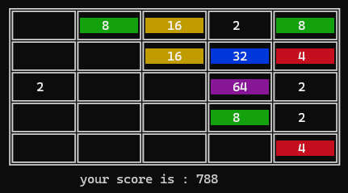

# 2048 GAME PROJECT 

* this the mini project for basic programing course SBU 1402 _ 1403 and my first experience for project .

  * the purpose of this project is to Designing a similar game as 2048 with new features .

  ## what is 2048 Game 

  ***2048*** is a single-player [sliding tile puzzle](https://en.wikipedia.org/wiki/Sliding_puzzle) video game written by Italian web developer Gabriele Cirulli and published on [GitHub](https://en.wikipedia.org/wiki/GitHub). The objective of the game is to slide numbered tiles on a grid to combine them to create a tile with the number 2048; however, one can continue to play the game after reaching the goal, creating tiles with larger numbers. It was originally written in [JavaScript](https://en.wikipedia.org/wiki/JavaScript) and [CSS](https://en.wikipedia.org/wiki/CSS) over a weekend, and released on 9 March 2014 as [free and open-source software](https://en.wikipedia.org/wiki/Free_and_open-source_software) subject to the [MIT License](https://en.wikipedia.org/wiki/MIT_License). Versions for [iOS](https://en.wikipedia.org/wiki/IOS) and [Android](https://en.wikipedia.org/wiki/Android_(operating_system)) followed in May 2014.

  *2048* was intended to be an improved version of two other games, both of which were clones of the iOS game *[Threes](https://en.wikipedia.org/wiki/Threes)* released a month earlier. Cirulli himself described *2048* as being "conceptually similar" to *Threes*. The release of *2048* resulted in the rapid appearance of many similar games, akin to the flood of *[Flappy Bird](https://en.wikipedia.org/wiki/Flappy_Bird)* variations from 2013. The game received generally positive reviews from critics, with it being described as "viral" and "addictive".

  ## Gameplay 

  *2048* is played on a plain 4×4 grid, with numbered tiles that slide when a player moves them using the four arrow keys. The game begins with two tiles already in the grid, having a value of either 2 or 4, and another such tile appears in a random empty space after each turn. Tiles slide as far as possible in the chosen direction until they are stopped by either another tile or the edge of the grid. If two tiles of the same number collide while moving, they will merge into a tile with the total value of the two tiles that collided. The resulting tile cannot merge with another tile again in the same move. Higher-scoring tiles emit a soft glow; the largest possible tile is 131,072.

  If a move causes three consecutive tiles of the same value to slide together, only the two tiles farthest along the direction of motion will combine. If all four spaces in a row or column are filled with tiles of the same value, a move parallel to that row/column will combine the first two and last two. A scoreboard on the upper-right keeps track of the user's score. The user's score starts at zero, and is increased whenever two tiles combine, by the value of the new tile.

  The game is won when a tile with a value of 2048 appears on the board. Players can continue beyond that to reach higher scores. When the player has no legal moves (there are no empty spaces and no adjacent tiles with the same value), the game ends

  ## Attention

* run the program with terminal to play easily and Comfortable

* in leader bored file the name of gamer and the score that give in the game will be save 

* some name will be exist in leader board . they are my records :)

* play and joy .

  ## Resources 

  * [play Online ](https://2048game.com/)
  *  [about 2048 GAME](https://2048game.com/)

# Thanks for your Attention 